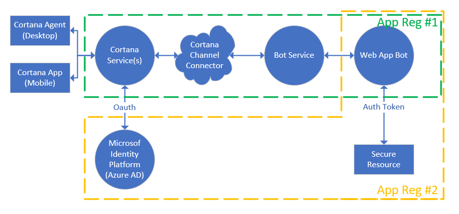
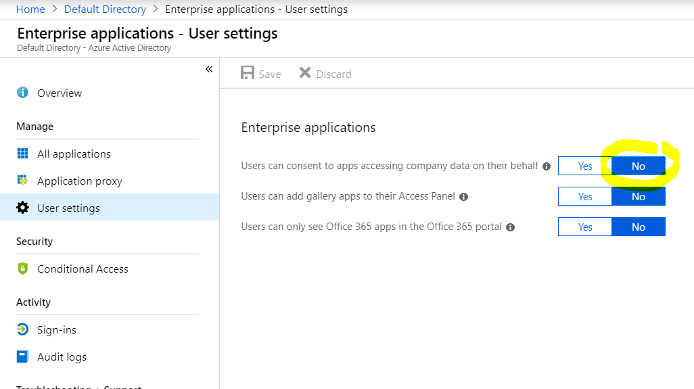
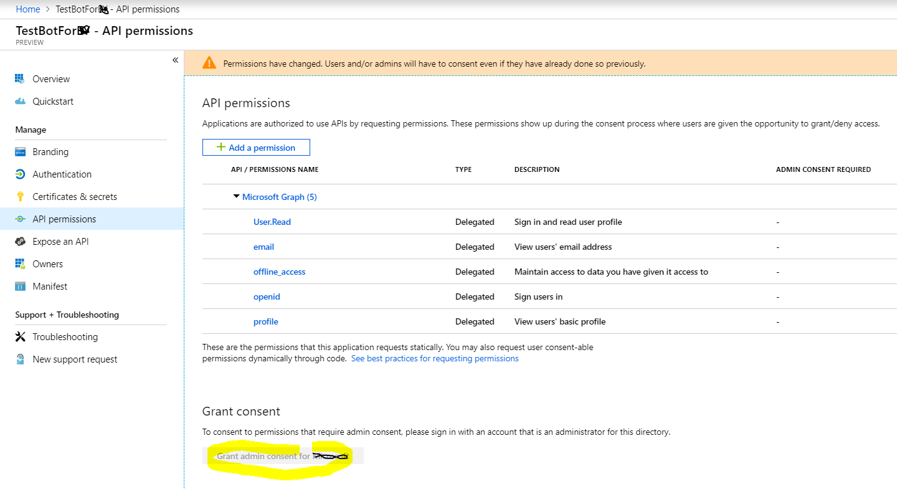
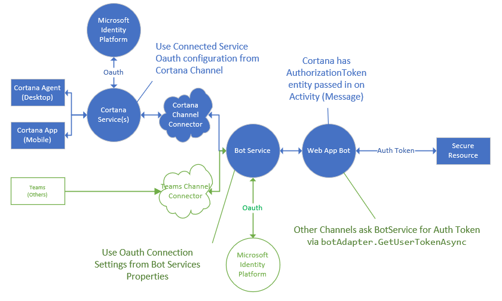

## Supporting Connected Services ##

With Cortana, you need two app registrations when building an AAD connected app. The first registration occurs when you, or your administrator (see **Enterprise Applications**), creates a Microsoft App ID and Secret. This allows Cortana to talk to the bot.  You need a second registration to allow your bot to talk to the resource provider.

The settings from `App Reg #2` are what would be entered in the Cortana Channel Configuration under _Cortana will manage my identity_.  

## Supporting Enterprise Applications ##

Many enterprises disallow users from granting access to corporate data. They can also prevent developers from granting permission to user allowable scopes.  In this example, from the `Azure Active Directory > Enterprise Applications > User Settings`, the administrator's have disallowed users from granting access to Enterprise data

In this case, the administrator should grant permission to the scopes added by the developer.

For trouble shooting, please refer to these links
1. https://docs.microsoft.com/en-us/azure/active-directory/develop/azure-ad-endpoint-comparison
1. https://docs.microsoft.com/en-us/azure/active-directory/develop/v2-permissions-and-consent
1. https://docs.microsoft.com/en-us/azure/active-directory/manage-apps/configure-user-consent
1. https://docs.microsoft.com/en-us/azure/active-directory/users-groups-roles/directory-assign-admin-roles#role-permissions
1. https://docs.microsoft.com/en-us/azure/active-directory/develop/app-objects-and-service-principals

## Supporting Multiple Channel OAuth ##

If you intend to support OAuth to a connected service for a single bot, but want to support multiple channel connectors, you will
need more than one app registration and in your code differentiate how and when to send OAuthCards.

Cortana allows you to Authenticate on Invocation, which means Cortana automatically prompts for sign in (without the need to send an OAuthCard through the conversation).
  

Note, that each app registration can have one redirect URL, and they should be on the same domain.  For example, bot service and Cortana have different redirect URLs.
1. https://token.botframework.com/.auth/web/redirect is the redirect URL for bot service OAuth
1. https://www.bing.com/agents/oauth is the redirect URL for Cortana OAuth

